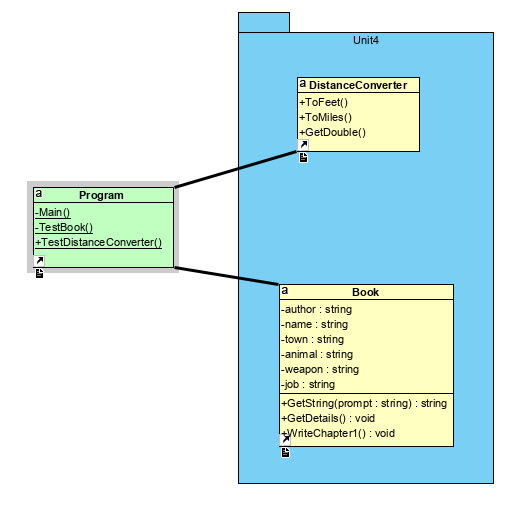

# BNU CO453 Section A Console Apps 2020
## by Dr Derek Peacock

This project contains a number of simple example of C# coding as part
of the Module CO453

## Unit 4 Console Applications
  * 4.1 Distance Converter
  * 4.2 Book

## Unit 5 Console Applications
  * 5.1 Tournament Scoring
  * 5.2 MP3 Chart Voding
